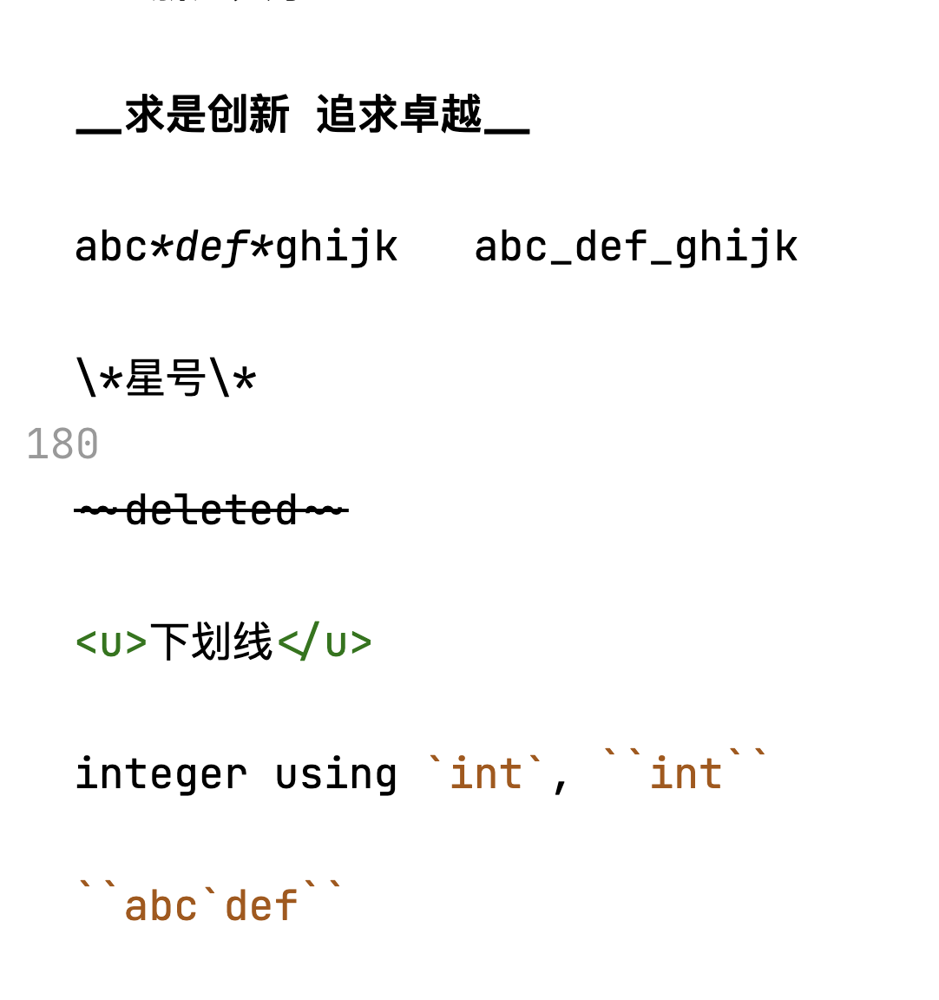

# 一级标题

## 二级标题

### 三

#### 四

##### 五

###### 六

### 1. abcd

#### 1.1 efgh

##### 1.1.1

##### 1.1.2

#### 1.2 sjadkl

### 2.

一级标题
=========

二级
------

dfsfdsjajklfjdksalfjdskl

jklsdkalsjdkslad

  sadjskla

dasdjksald  
asdjkldsjakld

> ## quote
> 
> dsadsadsadsa
> 
> asdsadsa
> 
> > sdsadsasa
> > 
> > dsaddsad
> > 
> > sdsadsa
> 
> sadsda
> sdasda

sdadssa

sdasda

- asadsjkald
- dsadsadsa

sadsa

* dsad
+ sdsadsa

-sadsadsad

- sdasda
* dsadsadksla
- 1 jdsadjksla
  
  - 1.1 sdasdasd
    
      sdsad
  
  - 1.2
    
    - 1.2.1 sdadsa
      
      - 1.2.1.1
        
        - 1.2.1.1.1
  
  - 1.3

- 2 sdajksda

----

- 1
  * 1.1
    + 1.1.1
  * 1.2
- 2

---

3. sadasd
   
   1. adsadsda
      
      1. sdasda
      
      2. sdasad
         
         1. sdasda
      
      3. dsadsadsa
      
      sdasdasd

4. dasdsadsa

5. sadsa
   
   - dsajdsa
   - dsajdkl
     - dsadsa

6. sdadsasa

sdasdadsad

---

***

___

- - -

-- - -- - -- -

---a

dasdsfd

-------------

sdasda

code blolkdsadsad

    #include <stdio.h>
    
    int main() {
        return 0;
    }

dsadsa

```c
#include <stdio.h>

int main() {
    return 0;
}
```

```c
#include <stdio.h>
```

```py
print("hello")
```

asdasd

**求是** 创新 追求*卓越*

***浙江大学***

__求是创新 追求卓越__

abc*def*ghijk   abc_def_ghijk

\*星号\*

~~deleted~~

<u>下划线</u>

integer using `int`, ``int``

``abc`def``




[g**oo**gle](www.google.com)

### test

[test](#test)

\<h1\>

| a      | b         | c         | d         |
| ------ |:--------- | ---------:|:---------:|
| dsadsa | dsadsadsa | dsadfafds | dsadsadsa |
| fdfd   | dfdsfdaf  |           |           |

---

safdsa $a^2+b^2=c^2$ fdasfdafda

$a^{21},\ \ \ \ \ \ \ \qquad x_{10}$

abcd $\dfrac{1}{2}$ efgh

$$
a^2+b^2=c^2\\
\frac{1+\dfrac{1}{3}}{2}
$$

$\sin(\frac{\pi}{2}),\cos \tan \sinh \log$

$\log_ee^2$

$\alpha \beta \gamma \phi \epsilon \lambda$

$\Alpha \Beta \Gamma \Lambda$

$\phi \varphi$

$\sin a$

$\mathrm{d}t \mathrm dt$

$\mathrm{sin} \text{some text}$

$\frac{\mathrm d}{\mathrm dt} \frac{\partial}{\partial x}$

$$
\sum_{i=0}^{10}i^2

$$

$\displaystyle\sum_{i=0}^{10}i^2$

$$
\int_a^bf(x)\mathrm dx
$$

$\displaystyle\int_a^bf(x)\mathrm dx$

$$
\iiint_\Omega \iint_V \oint \oiint
$$

$f'(x)$

$\sqrt[4]{\frac{1}{2}}$

$$
x=\frac{-b\pm\sqrt{b^2-4ac}}{2a}
$$

$$
\lim_{x\to +\infty}
$$

$\bar{a} \overline{abcd}$


$$
f=\begin{cases}
\dfrac{1}{x}+sasdasdas & x \ne 0\\
0           & x=0
\end{cases}
$$

$x\in \mathbb{R}$


